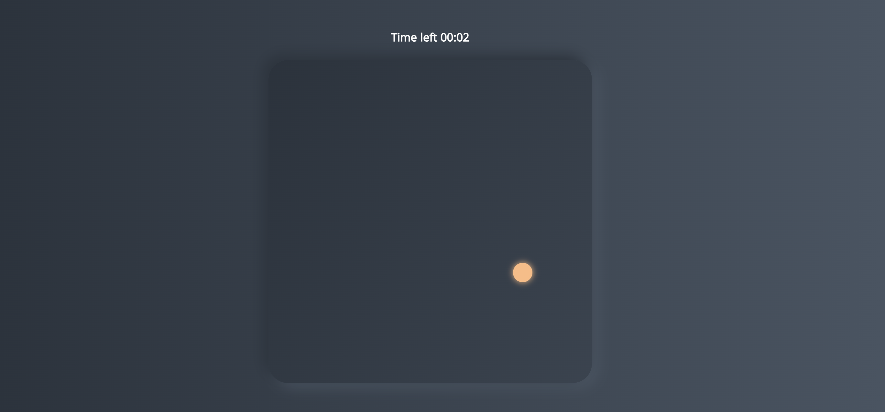
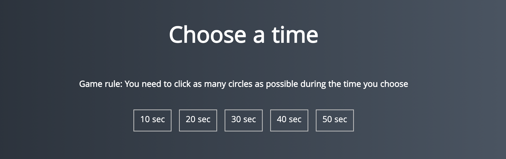

<hr v>

# Описание

Эта игра реализирована на основе JavaScript без приминения каких либо фреймворков. __Упрощенная__ версия игры где нужно стрелять в цели на скорость, только здесь мы не стреляем, а кликаем мышкой.

# Цель 
__Целью__ создания этого проекта было расмотрение различных элементов и __практика__ в JavaScript.

+ работа с ___динамикой___
+ создание ___таймеров___
+ выбор рандомной ___позиции___ и ___размеров___
+ работа с ___фунциями___
+ работа с ___масивами___
+ практика с принцыпами ___деструктуризации___
```JS
function createRandomCircle() {

    const circle = document.createElement('div');
    const { width, height } = board.getBoundingClientRect();
    const size = getRandomSize(20, 60)
    const x = getRandomSize(0, width - size)
    const y = getRandomSize(0, height - size) 
    circle.classList.add('circle')
    circle.style.width = `${size}px`
    circle.style.height = `${size}px`
    circle.style.top = `${x}px`
    circle.style.left = `${y}px`
    const color=getColor();
    circle.style.backgroundColor = color;
    console.log(circle.style.backgroundColor);
    circle.style.boxShadow=`0 0 10px   ${color}`
    board.append(circle);
}
```
# Как играть

Шаг первый: выберите продолжительность игры.
<!--  -->
Шаг второй: кликайте по цветным точкам разного размера.
<!--  -->
По окончанию игры вы увидете свой результат!


# Live Demo
Для удобности просмотра моего проэкта __следуйте__ __инструкциям__: 
+ после перехода по ссылке увеличте окно игры как показано на видео
+ нажмите кнопку __бежать__ в левом верхнем иглу
+ наслаждайтесь! 
[Aim-game](https://jsfiddle.net/EvaCherkashyna/u6qegm92/)


# Instruction about download
 
 1. Скопируйте ссылку, которую можете найти нажав на зеленую кнопку код
 2. В терминале git clone ___ссылка___
 3. Проект скопируеться в выбранную папку
   